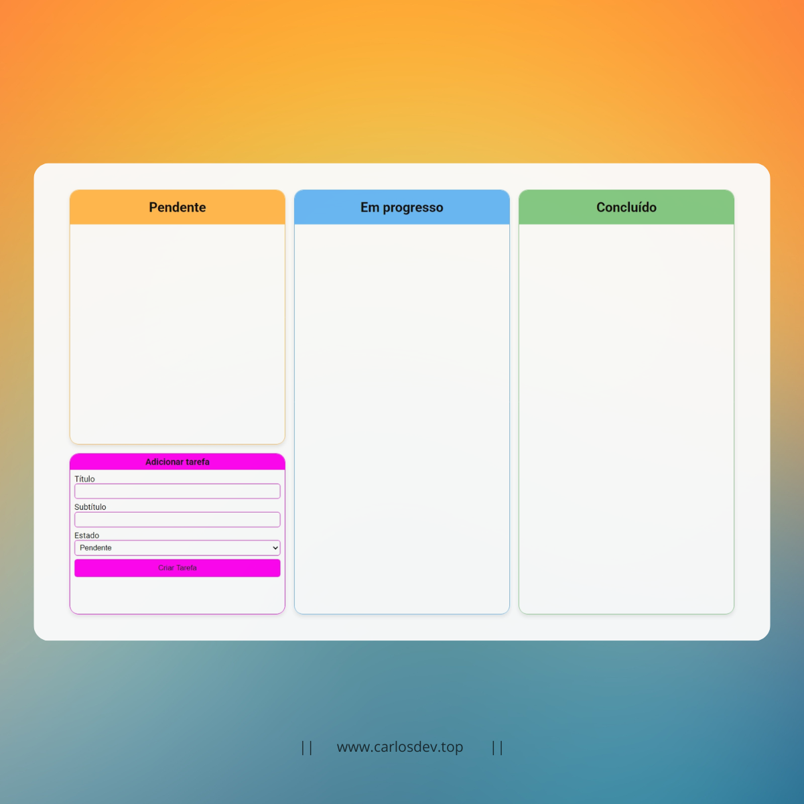
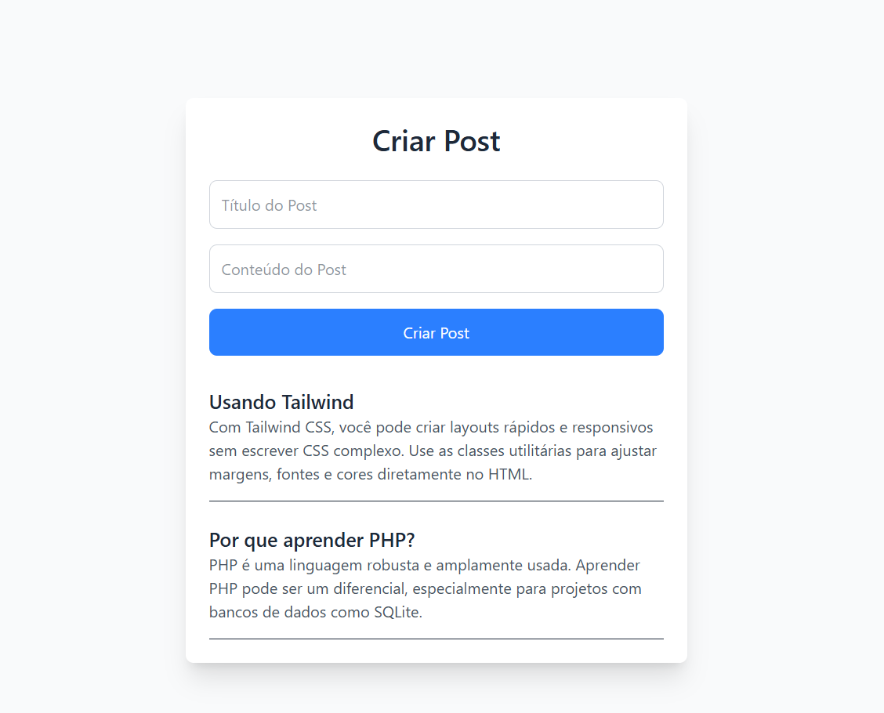
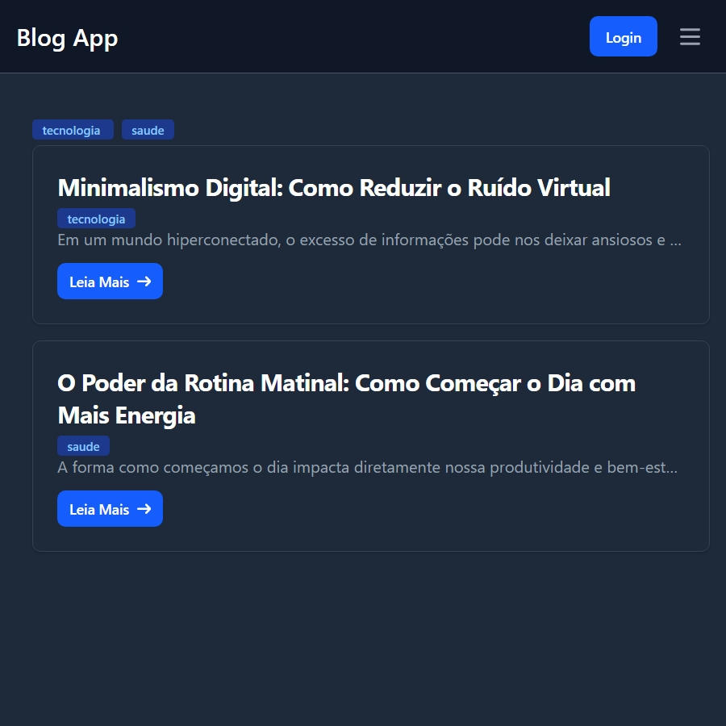

# 🧑‍💻 Projetos

- **01-random-word**:  
   Mostra ao usuário uma palavra aleatória em inglês obtida de uma API.

- **02-random-motivational-frases**:  
   Consulta uma API e exibe uma frase motivacional junto com o nome do autor.

- **03-page-created-on**:  
   Mostra de forma formatada a data em que a página foi criada.

- **04-date-now**:  
   Formata e exibe a data atual no seguinte formato:  
   _Exemplo: Sexta-feira, 24 de Janeiro de 2025_.

- **05-password-generator**:  
   Gera uma senha aleatória com base nas escolhas do usuário, como tamanho, inclusão de letras maiúsculas, números e símbolos.

- **06-greeting**:  
   Saúda o usuário de acordo com o horário do dia.

- **07-alert-message**:  
   Utilizando uma classe PHP para gerar uma mensagem de alerta.

- **08-multiplication-table**:  
   Cria uma tabuada a partir dos dados inserido pelo usuário (número, tipo de cálculo).

- **09-tic-tac-toe**:  
   O famoso jogo da velha feito em PHP.

- **10-twig-cards-organize**:  
   Organizador de tarefas com quadros para pendentes, em progresso e concluídos, que utiliza cookies para armazenar os dados.

   

- **11-sqlite-connection**:
  Um simples criador de posts para testar a conexão com banco de dados SQLite.

  

- **12-login-page**:
  Uma tela de login com conexão SQLite

- **13-blog-app**:
  Um simples app de blog, com postágens feita pelos usuários, método de login ainda nõa implementado

  

---

Espero que esses exercícios ajudem outros desenvolvedores que também estão começando a aprender PHP. Sinta-se à vontade para explorar ou sugerir melhorias!
